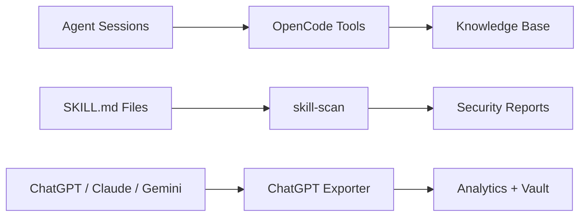

# Velvet Sojourner

**AI Infrastructure & Security Tools.**

A suite of open-source and freemium tools for the AI development lifecycle — security scanning, conversation analytics, and development infrastructure. We build tools that make the agent ecosystem safer, more observable, and more productive.

---

### 🔒 skill-scan

Security scanner for AI agent skills. Detects malware, secrets, obfuscation, prompt injection, and more in SKILL.md files.

- 8 rule categories, 4 output formats
- CI/CD integration (GitHub Actions, pre-commit)
- `pip install skill-scan`
- [github.com/tellemthatsme/skill-scan](https://github.com/tellemthatsme/skill-scan)

### 📤 ChatGPT Exporter

Export, analyze, and own AI conversations from ChatGPT, Claude, and Gemini.

- Multi-platform import, cost tracking, analytics dashboard
- Semantic search across all conversations
- Obsidian vault sync
- `pip install chatgpt-exporter`
- [github.com/tellemthatsme/chatgpt-exporter](https://github.com/tellemthatsme/chatgpt-exporter)

### 🛠 OpenCode Tools

Analytics infrastructure for AI development sessions. Session tracking, cost analytics, semantic search, and knowledge management for Claude Code / OpenCode.

- Internal tooling suite
- Located in `~/.local/share/opencode/` tools directory

---

## Architecture

---

## License

All open-source products are MIT licensed. Pro/Enterprise features available separately.

---

Built with Python · 2026
