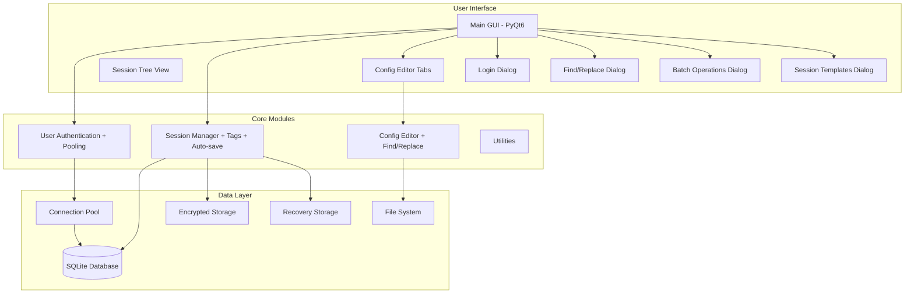

# Charm Crush Session Manager - Comprehensive Enhancement Plan

## Overview
A Windows desktop application for managing configuration files and sessions with user authentication and encrypted storage.

## Issues Identified

### Critical Bugs
1. **utils.py**: `import io` statement at line 369 should be at the top of the file
2. **config_editor.py**: Uses deprecated QRegExp instead of QRegularExpression
3. **session_manager.py**: No error handling for database operations
4. **user_auth.py**: No database connection pooling

### Missing Features
- Session tags/categories
- Session statistics
- Bulk operations (delete/export multiple)
- Auto-save functionality
- Session locking for concurrent access
- Import/export validation
- Find/replace in editor
- Bracket matching
- Session recovery after crash
- Recent sessions list
- Session templates
- User preferences storage
- Bulk user operations

## Enhancement Plan

### Phase 1: Critical Bug Fixes

#### 1.1 Fix utils.py - Move import io to top
```python
# Current (line 369):
import io

# Should be at top with other imports (around line 14)
```

#### 1.2 Replace deprecated QRegExp with QRegularExpression
In config_editor.py, update all syntax highlighters:
```python
# Old (deprecated):
from PyQt6.QtCore import QRegExp
key_pattern = QRegExp("\"[^\"]*\"\s*:")

# New (recommended):
from PyQt6.QtCore import QRegularExpression
key_pattern = QRegularExpression("\"[^\"]*\"\s*:")
```

### Phase 2: Session Manager Enhancements

#### 2.1 Add Error Handling
```python
class SessionManager:
    def create_session(self, name: str, ...) -> Optional[str]:
        """Create a new session with error handling."""
        try:
            # Existing logic
        except Exception as e:
            self._log_error(f"Failed to create session: {e}")
            return None
```

#### 2.2 Add Session Validation & Cleanup
```python
def validate_session(self, session_id: str) -> Dict:
    """Validate session integrity."""
    session = self.get_session(session_id)
    if not session:
        return {'valid': False, 'error': 'Session not found'}
    
    # Check files exist and are readable
    valid_files = []
    for file_info in session.get('files', []):
        if file_info['content'] is not None:
            valid_files.append(file_info)
    
    return {
        'valid': True,
        'file_count': len(valid_files),
        'invalid_files': len(session.get('files', [])) - len(valid_files)
    }

def cleanup_orphaned_files(self) -> int:
    """Remove files that reference non-existent sessions."""
    # Implementation
```

#### 2.3 Add Session Statistics
```python
def get_session_stats(self) -> Dict:
    """Get session statistics."""
    sessions = self.get_all_sessions()
    total_files = 0
    total_size = 0
    
    for session in sessions:
        session_data = self.get_session(session['id'])
        file_count = len(session_data.get('files', []))
        total_files += file_count
    
    return {
        'total_sessions': len(sessions),
        'total_files': total_files,
        'average_files_per_session': total_files / len(sessions) if sessions else 0
    }

def get_user_activity_stats(self, days: int = 30) -> Dict:
    """Get user activity statistics."""
    # Implementation for recent activity
```

#### 2.4 Add Bulk Operations
```python
def delete_sessions(self, session_ids: List[str]) -> Dict:
    """Delete multiple sessions."""
    results = {'deleted': 0, 'failed': 0, 'errors': []}
    for session_id in session_ids:
        if self.delete_session(session_id):
            results['deleted'] += 1
        else:
            results['failed'] += 1
    return results

def export_sessions(self, session_ids: List[str], output_dir: str) -> Dict:
    """Export multiple sessions to a directory."""
    results = {'exported': 0, 'failed': 0}
    for session_id in session_ids:
        output_path = os.path.join(output_dir, f"{session_id}.json")
        if self.export_session(session_id, output_path):
            results['exported'] += 1
        else:
            results['failed'] += 1
    return results
```

#### 2.5 Add Session Tags/Categories
```python
def add_session_tag(self, session_id: str, tag: str) -> bool:
    """Add a tag to a session."""
    session = self.get_session(session_id)
    if session:
        tags = session.get('data', {}).get('tags', [])
        if tag not in tags:
            tags.append(tag)
            return self.update_session(session_id, session_data={'tags': tags})
    return False

def remove_session_tag(self, session_id: str, tag: str) -> bool:
    """Remove a tag from a session."""
    session = self.get_session(session_id)
    if session:
        tags = session.get('data', {}).get('tags', [])
        if tag in tags:
            tags.remove(tag)
            return self.update_session(session_id, session_data={'tags': tags})
    return False

def get_sessions_by_tag(self, tag: str) -> List[Dict]:
    """Get all sessions with a specific tag."""
    sessions = self.get_all_sessions()
    return [s for s in sessions if tag in s.get('data', {}).get('tags', [])]

def get_all_tags(self) -> List[str]:
    """Get all unique tags."""
    sessions = self.get_all_sessions()
    tags = set()
    for session in sessions:
        session_tags = session.get('data', {}).get('tags', [])
        tags.update(session_tags)
    return list(tags)
```

#### 2.6 Add Auto-Save Functionality
```python
class SessionManager:
    def __init__(self, user_db: UserDatabase, user_id: int, auto_save_interval: int = 60):
        # Existing init
        self.auto_save_interval = auto_save_interval  # seconds
        self.auto_save_enabled = False
        self._auto_save_timer = None
        self._pending_changes = {}
    
    def enable_auto_save(self, enabled: bool):
        """Enable/disable auto-save."""
        self.auto_save_enabled = enabled
        if enabled and not self._auto_save_timer:
            self._start_auto_save_timer()
        elif not enabled and self._auto_save_timer:
            self._stop_auto_save_timer()
    
    def _start_auto_save_timer(self):
        """Start the auto-save timer."""
        import threading
        self._auto_save_timer = threading.Timer(
            self.auto_save_interval,
            self._auto_save_worker
        )
        self._auto_save_timer.start()
    
    def _auto_save_worker(self):
        """Save all pending changes."""
        for session_id, data in self._pending_changes.items():
            self.update_session(session_id, session_data=data)
        self._pending_changes.clear()
        self._start_auto_save_timer()
```

#### 2.7 Add Session Locking
```python
import threading

class SessionLock:
    """Session-level locking for concurrent access."""
    def __init__(self):
        self._locks = {}
        self._lock = threading.Lock()
    
    def acquire(self, session_id: str, timeout: float = 10.0):
        """Acquire lock on a session."""
        with self._lock:
            if session_id not in self._locks:
                self._locks[session_id] = threading.Lock()
        return self._locks[session_id].acquire(timeout=timeout)
    
    def release(self, session_id: str):
        """Release lock on a session."""
        with self._lock:
            if session_id in self._locks:
                self._locks[session_id].release()
```

#### 2.8 Improve Import/Export Validation
```python
def validate_import_data(self, import_data: Dict) -> tuple:
    """Validate import data before importing."""
    errors = []
    warnings = []
    
    # Check required fields
    if 'session' not in import_data:
        errors.append("Missing 'session' key in import data")
    
    session = import_data.get('session', {})
    if not session.get('name'):
        errors.append("Session name is required")
    
    # Check files
    files = import_data.get('files', [])
    for i, file_info in enumerate(files):
        if not file_info.get('file_path'):
            errors.append(f"File {i}: Missing file_path")
    
    return (len(errors) == 0, errors, warnings)

def import_session_safe(self, input_path: str, new_name: str = None) -> tuple:
    """Import session with validation, returning (success, session_id, errors)."""
    try:
        with open(input_path, 'r', encoding='utf-8') as f:
            import_data = json.load(f)
    except Exception as e:
        return (False, None, [f"Failed to read file: {e}"])
    
    valid, errors, warnings = self.validate_import_data(import_data)
    if not valid:
        return (False, None, errors)
    
    session_id = self.import_session(input_path, new_name)
    return (session_id is not None, session_id, [])
```

### Phase 3: User Auth Improvements

#### 3.1 Add Database Connection Pooling
```python
import sqlite3
from contextlib import contextmanager
from queue import Queue

class UserDatabase:
    def __init__(self, db_path: str = None, pool_size: int = 5):
        # Existing init
        self._connection_pool = Queue(maxsize=pool_size)
        self._init_pool()
    
    def _init_pool(self):
        """Initialize connection pool."""
        for _ in range(self._connection_pool.maxsize):
            conn = sqlite3.connect(self.db_path)
            self._connection_pool.put(conn)
    
    @contextmanager
    def get_connection(self):
        """Get connection from pool."""
        conn = self._connection_pool.get()
        try:
            yield conn
        finally:
            self._connection_pool.put(conn)
    
    def close_all(self):
        """Close all pooled connections."""
        while not self._connection_pool.empty():
            conn = self._connection_pool.get()
            conn.close()
```

#### 3.2 Add Bulk User Operations
```python
def get_all_users(self) -> List[Dict]:
    """Get all users."""
    with self.get_connection() as conn:
        cursor = conn.cursor()
        cursor.execute(
            'SELECT id, username, created_at, last_login FROM users WHERE is_active = 1'
        )
        return [{'id': row[0], 'username': row[1], ...} for row in cursor.fetchall()]

def deactivate_user(self, user_id: int) -> bool:
    """Deactivate a user (soft delete)."""
    with self.get_connection() as conn:
        cursor = conn.cursor()
        cursor.execute('UPDATE users SET is_active = 0 WHERE id = ?', (user_id,))
        conn.commit()
        return cursor.rowcount > 0

def get_user_sessions_count(self, user_id: int) -> int:
    """Get number of sessions for a user."""
    with self.get_connection() as conn:
        cursor = conn.cursor()
        cursor.execute('SELECT COUNT(*) FROM sessions WHERE user_id = ?', (user_id,))
        return cursor.fetchone()[0]
```

#### 3.3 Add User Preferences Storage
```python
def save_user_preferences(self, user_id: int, preferences: Dict) -> bool:
    """Save user preferences."""
    pref_json = json.dumps(preferences)
    with self.get_connection() as conn:
        cursor = conn.cursor()
        cursor.execute(
            'INSERT OR REPLACE INTO user_preferences (user_id, preferences) VALUES (?, ?)',
            (user_id, pref_json)
        )
        conn.commit()
        return True

def get_user_preferences(self, user_id: int) -> Dict:
    """Get user preferences."""
    with self.get_connection() as conn:
        cursor = conn.cursor()
        cursor.execute(
            'SELECT preferences FROM user_preferences WHERE user_id = ?', (user_id,)
        )
        result = cursor.fetchone()
        if result:
            return json.loads(result[0])
        return {}
```

### Phase 4: Config Editor Enhancements

#### 4.1 Add Find/Replace Functionality
```python
class ConfigEditor(QWidget):
    def __init__(self, parent=None):
        # Existing init
        self._find_dialog = None
    
    def show_find_dialog(self):
        """Show find dialog."""
        if not self._find_dialog:
            self._find_dialog = FindReplaceDialog(self)
        self._find_dialog.show()
    
    def find_text(self, text: str, forward: bool = True) -> bool:
        """Find text in editor."""
        # Implementation using QTextCursor
```

#### 4.2 Add Bracket Matching
```python
class ConfigEditor(QWidget):
    def __init__(self, parent=None):
        # Existing init
        self.editor.cursorPositionChanged.connect(self._highlight_matching_bracket)
    
    def _highlight_matching_bracket(self):
        """Highlight matching bracket."""
        cursor = self.editor.textCursor()
        char = cursor.document().characterAt(cursor.position())
        
        matching = {'{': '}', '[': ']', '(': ')', '"': '"', "'": "'"}
        if char in matching:
            # Find matching bracket and highlight
```

### Phase 5: GUI Enhancements

#### 5.1 Add Session Recovery After Crash
```python
class MainWindow(QMainWindow):
    def __init__(self):
        # Existing init
        self._recovery_file = os.path.join(
            os.environ.get('APPDATA', os.path.expanduser('~')),
            'CharmCrush', 'recovery.json'
        )
        self._check_recovery()
    
    def _check_recovery(self):
        """Check for and load recovery data."""
        if os.path.exists(self._recovery_file):
            # Show dialog asking to recover
            result = QMessageBox.question(
                self, "Recovery",
                "Unsaved sessions were recovered. Load them?",
                QMessageBox.StandardButton.Yes | QMessageBox.StandardButton.No
            )
            if result == QMessageBox.StandardButton.Yes:
                self._load_recovery()
    
    def _save_recovery(self):
        """Save current state for recovery."""
        recovery_data = {
            'unsaved_sessions': [],  # Collect unsaved session data
            'timestamp': datetime.now().isoformat()
        }
        # Implementation
    
    def _load_recovery(self):
        """Load recovered sessions."""
        # Implementation
```

#### 5.2 Add Recent Sessions List
```python
class MainWindow(QMainWindow):
    def __init__(self):
        # Existing init
        self._recent_sessions = []
        self._load_recent_sessions()
        self._update_recent_sessions_menu()
    
    def _load_recent_sessions(self):
        """Load recent sessions from config."""
        # Implementation
    
    def _save_recent_sessions(self):
        """Save recent sessions to config."""
        # Implementation
    
    def _update_recent_sessions_menu(self):
        """Update the recent sessions menu."""
        # Implementation
    
    def add_to_recent_sessions(self, session_id: str, session_name: str):
        """Add session to recent list."""
        # Implementation
```

#### 5.3 Add Batch Session Operations
```python
class MainWindow(QMainWindow):
    def show_batch_operations_dialog(self):
        """Show batch operations dialog."""
        dialog = BatchOperationsDialog(self)
        if dialog.exec() == QDialog.DialogCode.Accepted:
            operation = dialog.get_operation()
            session_ids = dialog.get_selected_sessions()
            
            if operation == 'delete':
                self._batch_delete_sessions(session_ids)
            elif operation == 'export':
                self._batch_export_sessions(session_ids)
            elif operation == 'tag':
                self._batch_tag_sessions(session_ids, dialog.get_tag())
```

#### 5.4 Add Session Templates
```python
def create_session_from_template(self, template_name: str, session_name: str) -> Optional[str]:
    """Create a session from a template."""
    templates = {
        'empty': {'name': session_name, 'description': '', 'files': []},
        'basic_config': {
            'name': session_name,
            'description': 'Basic configuration template',
            'files': [{'file_path': 'config.json', 'format': 'json', 'content': b'{}'}]
        },
        'database_config': {
            'name': session_name,
            'description': 'Database configuration template',
            'files': [
                {'file_path': 'config.json', 'format': 'json', 'content': b'{}'},
                {'file_path': 'connections.ini', 'format': 'ini', 'content': b''}
            ]
        }
    }
    
    if template_name in templates:
        template = templates[template_name]
        return self.create_session(
            name=session_name,
            description=template.get('description', ''),
            files=template.get('files', [])
        )
    return None
```

#### 5.5 Add Keyboard Shortcut Improvements
```python
def setup_shortcuts(self):
    """Setup keyboard shortcuts."""
    # Existing shortcuts
    
    # Additional shortcuts
    QShortcut("Ctrl+F", self, self.show_find_dialog)
    QShortcut("Ctrl+H", self, self.show_find_replace_dialog)
    QShortcut("Ctrl+Shift+T", self, self.show_templates_dialog)
    QShortcut("Ctrl+E", self, self.export_current_session)
    QShortcut("Ctrl+I", self, self.import_session)
    QShortcut("F2", self, self.rename_current_session)
    QShortcut("Delete", self, self.delete_current_session)
```

## Folder Structure (Updated)
```
charm-crush/
├── main.py                    # Entry point
├── config.json               # App config
├── requirements.txt          # Dependencies
├── build.bat                # Build script
├── build_exe.py             # PyInstaller spec file
└── charm_crush/
    ├── __init__.py
    ├── user_auth.py         # User accounts + encryption + connection pooling
    ├── session_manager.py   # Session CRUD + tags + auto-save + locking
    ├── config_editor.py     # File editor + find/replace + bracket matching
    ├── gui.py              # Main PyQt6 GUI + recovery + batch ops + templates
    └── utils.py            # Helpers + fixed imports
```

## Architecture Diagram (Enhanced)


## Implementation Order
1. Fix critical bugs (utils.py import, QRegExp)
2. Add error handling to session_manager.py
3. Add session statistics and validation
4. Add bulk operations
5. Add session tags
6. Add auto-save functionality
7. Add session locking
8. Improve import/export validation
9. Add database connection pooling
10. Add bulk user operations
11. Add user preferences storage
12. Add find/replace to editor
13. Add bracket matching
14. Add session recovery
15. Add recent sessions list
16. Add batch operations
17. Add session templates
18. Improve keyboard shortcuts
19. Test all changes
20. Update documentation

## Database Schema Updates
```sql
-- Add user preferences table
CREATE TABLE IF NOT EXISTS user_preferences (
    user_id INTEGER PRIMARY KEY,
    preferences TEXT,
    FOREIGN KEY (user_id) REFERENCES users(id)
)

-- Add session tags table (alternative to embedding in data)
CREATE TABLE IF NOT EXISTS session_tags (
    id INTEGER PRIMARY KEY AUTOINCREMENT,
    session_id TEXT NOT NULL,
    tag TEXT NOT NULL,
    FOREIGN KEY (session_id) REFERENCES sessions(id),
    UNIQUE(session_id, tag)
)
```

## Security Considerations
1. **Password Storage**: PBKDF2-HMAC-SHA256 with 100,000 iterations
2. **Session Data**: Fernet symmetric encryption (AES-128)
3. **Key Management**: Stored in OS-specific secure location
4. **SQL Injection Protection**: Parameterized queries
5. **Input Validation**: Sanitize all user inputs
6. **Session Locking**: Prevent concurrent modifications
7. **Recovery Data**: Encrypt temporary recovery files

## Testing Plan
1. Unit tests for all new methods
2. Integration tests for database operations
3. UI tests for new dialogs and features
4. Performance tests for connection pooling
5. Security tests for encryption and locking
